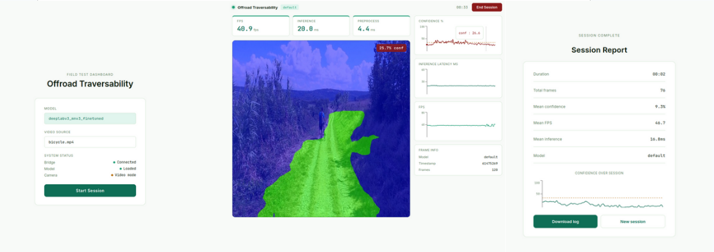
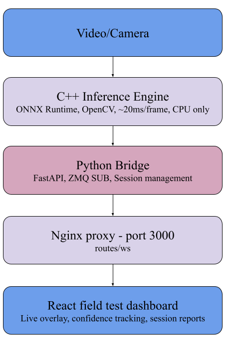

# Offroad Traversability

Real-time monocular terrain traversability estimation for autonomous ground vehicles (AGVs).
Deployable on Linux edge devices as a single `.deb` package.

<p align="center">
  
</p>

---

## Overview

This system takes a monocular RGB camera feed or recorded video and produces a real-time
traversability map — classifying terrain as traversable or non-traversable using a fine-tuned
DeepLabV3+ segmentation model with MobileNetV3 backbone, trained on the
[GOOSE dataset](https://goose-dataset.de/).


<p align="center">
  
</p>


The system runs entirely on CPU, making it suitable for deployment on low-cost edge hardware
without a GPU.

---

## Architecture

<p align="center">
  
</p>
## System Requirements

- Ubuntu 20.04 / 22.04 (amd64)
- OpenCV 4.x
- ZeroMQ 4.x
- CMake 3.16+
- Python 3.10+
- Nginx

All dependencies are installed automatically by the `.deb` package.

---

## Installation

### Option A: Debian package (recommended)

**1. Download**

```bash
wget https://github.com/thabsheerjm/offroad_traversability/releases/download/v2.0/offroad-traversability_2.0_amd64.deb
```

**2. Install**

```bash
sudo apt install ./offroad-traversability_2.0_amd64.deb
```

The installer will:
- Install all system dependencies
- Compile the C++ inference engine natively on your machine
- Set up the Python bridge with its own virtual environment
- Configure Nginx to serve the dashboard on port 3000
- Enable and start the bridge service automatically

**3. Add your ONNX model**

```bash
sudo cp your_model.onnx /usr/local/lib/offroad/models/
```

The model must accept input shape `[1, 3, H, W]` and produce output shape `[1, 1, H, W]`
as raw logits. Recommended input resolution: 512×512.

**4. Add videos**

```bash
sudo cp your_video.mp4 /var/lib/offroad/videos/
```

Supported formats: `.mp4`, `.avi`, `.mov`

**5. Open the dashboard**

```
http://localhost:3000
```

---

### Option B: From source

**1. Clone**

```bash
git clone https://github.com/thabsheerjm/offroad_traversability.git
cd offroad_traversability
```

**2. Install system dependencies**

```bash
sudo apt install cmake build-essential libopencv-dev libzmq3-dev python3-venv nginx
```

**3. Download ONNX Runtime**

Download ONNX Runtime 1.22.0 for Linux x64 from:
https://github.com/microsoft/onnxruntime/releases

Extract and place in the project root as `onnxruntime/`.

**4. Build the C++ backend**

```bash
mkdir build && cd build
cmake .. -DONNXRUNTIME_DIR=../onnxruntime
make -j$(nproc)
cd ..
```

**5. Set up the Python bridge**

```bash
python3 -m venv off_env
source off_env/bin/activate
pip install -r bridge/requirements.txt
```

**6. Build the dashboard**

```bash
cd dashboard
npm install
npm run build
cd ..
```

**7. Configure**

```bash
cp config/offroad.yaml config/offroad-dev.yaml
# edit config/offroad-dev.yaml with your local paths
```

**8. Run**

Terminal 1 — bridge:
```bash
source off_env/bin/activate
OFFROAD_CONFIG=config/offroad-dev.yaml python3 bridge/bridge.py
```

Terminal 2 — dashboard (development):
```bash
cd dashboard && npm run dev
```

Open `http://localhost:5173`

---

## Usage

### Starting a session

1. Open `http://localhost:3000` in a browser
2. The pre-session screen shows system status and available videos
3. Select a video source from the dropdown
4. Click **Start Session**

### During a session

- Green overlay — traversable terrain
- Blue overlay — non-traversable terrain
- Confidence badge (top-right) — green above threshold, red below
- Right panel shows confidence, inference latency, and FPS over time
- Session timer shown in the top-right corner

### Ending a session

1. Click **End Session**
2. The session report shows summary statistics for the run
3. Click **Download log** to save a CSV with per-frame data

### Session log format

```
timestamp_us, model_id, confidence, inference_ms, preprocess_ms, fps
```

---

## Configuration

Edit `/etc/offroad/offroad.yaml`:

```yaml
backend:
  binary: /usr/local/bin/offroad_segmentation
  model:  /usr/local/lib/offroad/models/your_model.onnx

video:
  source_dir: /var/lib/offroad/videos
  output_dir: /var/lib/offroad/output

logging:
  log_dir: /var/lib/offroad/logs

server:
  zmq_port:    5555
  bridge_port: 8000
```

After editing, restart the bridge:

```bash
sudo systemctl restart offroad-bridge
```

---

## Service Management

```bash
# check status
sudo systemctl status offroad-bridge

# start
sudo systemctl start offroad-bridge

# stop
sudo systemctl stop offroad-bridge

# restart
sudo systemctl restart offroad-bridge

# view live logs
sudo journalctl -u offroad-bridge -f
```

---

## Uninstall

```bash
sudo apt remove offroad-traversability
```

This stops and disables all services and removes installed files.
Logs in `/var/lib/offroad/logs/` and model files are preserved.

To remove everything including data:

```bash
sudo apt remove offroad-traversability
sudo rm -rf /var/lib/offroad
sudo rm -rf /usr/local/lib/offroad
sudo rm -f /usr/local/bin/offroad_segmentation
sudo rm -f /etc/offroad/offroad.yaml
sudo rm -f /etc/nginx/sites-enabled/offroad
sudo rm -f /etc/nginx/sites-available/offroad
sudo systemctl reload nginx
```

---

## Performance

Tested on Intel Core i7, CPU-only, Ubuntu 22.04:

| Metric | Value |
|---|---|
| Inference latency | ~17–20 ms |
| Preprocessing | ~4–5 ms |
| End-to-end FPS | ~40–47 fps |
| Input resolution | 512 × 512 |

---

## Repository Structure

```
offroad_traversability/
├── backend/      C++ inference engine
│   ├── src/      source files
│   └── include/  headers
├── bridge/       Python ZeroMQ → WebSocket bridge
├── dashboard/    React field test dashboard
├── training/     PyTorch training pipeline
├── config/       runtime configuration
└── deploy/       Debian packaging and build scripts
```

---

## Training

The model was fine-tuned on the [GOOSE dataset](https://goose-dataset.de/) using PyTorch
and exported to ONNX. The training pipeline is in `training/`.

---

## License

MIT — see [LICENSE](LICENSE)

---

## Citation

```bibtex
@misc{offroad_traversability_2026,
  author = {thabsheerjm},
  title  = {Offroad Traversability: Real-time Monocular Terrain Estimation for AGVs},
  year   = {2026},
  url    = {https://github.com/thabsheerjm/offroad_traversability}
}
```
